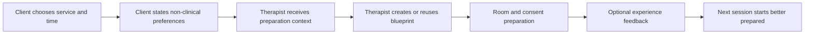

# Booking add-on requirements

Status: Conditional proposal; not approved for implementation
Last updated: 2026-07-18

## Recommendation

SessionScape should support booking, but it should not begin by building a full booking and payment platform.

Recommended sequence:

1. **External booking bridge:** each therapist can add a link to the booking tool they already use. This is a core integration, not a paid add-on.
2. **Calendar connection:** import or synchronize busy times and associate an appointment with a SessionScape preparation workflow, with explicit permission.
3. **Native Booking Lite:** offer an optional paid module only after demand is proven. It covers availability, service selection, requests/confirmation, reminders, rescheduling, cancellation, and preparation context.
4. **Deposits and payments:** add through a hosted, marketplace-capable payment provider only in approved markets; SessionScape never handles raw card data.

A generic calendar is not a strong differentiator. Square and Fresha already offer online booking, reminders, payments, cancellation protection, and other practice-management features at low monthly prices or with a free tier ([Square Appointments pricing](https://squareup.com/us/en/appointments/pricing), [Fresha pricing](https://www.fresha.com/pricing)). The reason to choose SessionScape booking must be the connected workflow.

## Therapist benefit

The add-on creates value when it closes this loop:

Expected benefits:

- Fewer messages and calls needed to find a time.
- A single transition from appointment to session preparation.
- Earlier visibility into non-clinical preferences such as scent, music, pressure range, communication style, and exclusions.
- Reminders that can include arrival and preparation information.
- Better calendar protection through a clear cancellation policy and, later, deposits or authorized no-show fees.
- Less duplicate entry across scheduling, preference, and planning tools.
- More consistent rebooking after a successful session.

Square documents that reminders can prompt clients to confirm or change plans and that deposits, prepayments, or an authorized card hold can support cancellation policies and cash flow ([Square reminders](https://squareup.com/us/en/appointments/features/reminders), [Square cancellation and prepayment policies](https://squareup.com/help/us/en/article/5493-manage-booking-cancellations-and-prepayment-policies)). These are useful baseline benefits, not unique SessionScape claims.

## When the add-on is not beneficial

- The therapist is satisfied with an existing scheduler and does not want to migrate.
- The practice requires complex resources, classes, payroll, memberships, inventory, or point of sale.
- Calendar synchronization cannot reliably prevent double booking.
- The therapist serves a market where the chosen payment or messaging provider is unsupported.
- Building it would delay validation of the core session-design value.

For these cases, SessionScape shall support an external booking URL and later consider integrations rather than forced replacement.

## Scope by phase

| Capability | External bridge | Booking Lite | Payments phase |
| --- | --- | --- | --- |
| Therapist booking URL | Yes | Yes | Yes |
| Services, duration, buffers, availability | No | Yes | Yes |
| Request or instant confirmation | No | Yes | Yes |
| Time-zone-safe calendar | No | Yes | Yes |
| Email confirmations and reminders | Existing provider | Yes | Yes |
| Client self-reschedule/cancel | Existing provider | Yes | Yes |
| Preference questions | SessionScape link | Yes, minimal fields | Yes, minimal fields |
| Appointment-to-blueprint action | Link/import where possible | Native | Native |
| Deposits, prepayment, no-show fee | Existing provider | No | Yes, approved markets only |
| SMS | Existing provider | Optional usage feature | Optional usage feature |
| SOAP notes or clinical intake | No | No | No |
| Marketplace discovery | No | No | No |

## Functional requirements

### Provider configuration

| ID | Requirement |
| --- | --- |
| BK-01 | A provider can enable or disable booking without changing access to core SessionScape features. |
| BK-02 | A provider can define services, duration, cleanup/preparation buffers, location or remote status, price display, and whether requests need approval. |
| BK-03 | A provider can set working hours, breaks, lead time, maximum advance window, and per-day limits in the provider's IANA time zone. |
| BK-04 | A provider can publish a booking page and preview exactly what a client will see. |
| BK-05 | A provider can connect an external calendar using least-privilege authorization and can disconnect it at any time. |
| BK-06 | Busy-time synchronization must fail closed: an uncertain or stale slot is not offered as available. |
| BK-07 | A provider can define a plain-language cancellation, late-arrival, rescheduling, and refund policy appropriate to the activated market. |

### Client booking

| ID | Requirement |
| --- | --- |
| BK-08 | A client can view services and availability without creating a SessionScape client account. |
| BK-09 | The booking flow displays date, time, time zone, duration, location, total price, payment timing, and cancellation policy before confirmation. |
| BK-10 | The client provides only contact data required to fulfill the appointment and receive transactional messages. |
| BK-11 | Marketing consent is separate, optional, and never bundled with booking acceptance. |
| BK-12 | Preference questions remain optional unless a field is genuinely required for safe service delivery; they do not request diagnoses, medications, or SOAP-note content. |
| BK-13 | The client can decline aroma, choose not to state preferences, and communicate exclusions without selecting a sensitive-area service. |
| BK-14 | The client receives confirmation and can reschedule or cancel according to the disclosed policy. |
| BK-15 | The flow does not accept bookings for minors in the first release. |

### Preparation connection

| ID | Requirement |
| --- | --- |
| BK-16 | A confirmed appointment creates a preparation task but does not automatically generate hands-on technique recommendations. |
| BK-17 | The therapist can start from a prior blueprint, a service template, a curated theme, or a blank blueprint. |
| BK-18 | Appointment contact data and client-stated preferences are visible only to authorized members of that workspace. |
| BK-19 | Cancellation removes the appointment from active preparation views while preserving only the minimum audit and financial records required by policy or law. |
| BK-20 | Booking analytics do not include message bodies, preference values, client names, or contact details. |

### Payments, deposits, and fees

| ID | Requirement |
| --- | --- |
| BK-21 | Payment capability is controlled per market and shall remain unavailable where provider onboarding, payout, refund, tax, or consumer requirements have not been approved. |
| BK-22 | Checkout uses provider-hosted or tokenized payment components; SessionScape systems never receive raw primary account numbers or card security codes. |
| BK-23 | The provider is shown processor fees, SessionScape fees, taxes if applicable, payout timing, refund behavior, dispute responsibility, and negative-balance handling before activation. |
| BK-24 | Deposits, prepayments, and no-show charges require a displayed policy and the client's affirmative authorization. |
| BK-25 | A provider can issue full or partial refunds and see an immutable financial event history. |
| BK-26 | SessionScape shall complete a PCI scope assessment even when hosted payment components are used; PCI DSS applies to entities that store, process, or transmit cardholder data and may affect connected systems ([PCI SSC merchant guidance](https://listings.pcisecuritystandards.org/merchants/)). |

## Non-functional requirements

| ID | Requirement |
| --- | --- |
| BK-NF-01 | Slot reservation and confirmation operations are idempotent and resistant to concurrent double booking. |
| BK-NF-02 | Dates are stored as instants plus the booking time zone; daylight-saving transitions are covered by automated tests. |
| BK-NF-03 | Booking, cancellation, refund, policy-version, and authorization events are auditable. |
| BK-NF-04 | Transactional delivery failures are visible to the provider and support safe retry. |
| BK-NF-05 | Critical booking flows meet WCAG 2.2 AA and work with keyboard and screen-reader navigation. |
| BK-NF-06 | Availability and booking status have defined service-level objectives before public launch. |
| BK-NF-07 | Data export, deletion, retention, and incident-response procedures include appointment data. |

## Commercial model hypothesis

### Recommended experiment

- External booking link: included in the free or core plan.
- Calendar connection and appointment-to-blueprint shortcut: include in Professional during beta to test usage.
- Native Booking Lite: test at USD 9, USD 12, and USD 15 per month as an add-on.
- SMS: pass through usage cost with a clearly disclosed allowance or rate.
- Payments: pass through processor fees; do not add a platform percentage until therapists understand the value and unit economics are known.

An add-on is preferable to forcing every subscriber to fund booking because many therapists already have a scheduler. Annual and bundle discounts can be tested after standalone willingness to pay is measured.

## Build gate

Native Booking Lite shall not enter implementation until all of the following are true:

1. At least 8 target therapists have been interviewed, including at least 5 who currently use booking software.
2. At least 60% of interviewed target therapists identify booking-to-preparation handoff as a recurring problem, not merely a desirable feature.
3. At least 5 therapists complete an external-link or clickable booking-to-blueprint pilot.
4. At least 3 agree to a realistic paid pilot or refundable deposit within the proposed range.
5. The business chooses whether to build, integrate, or partner after comparing 24-month total cost, support load, migration risk, and differentiation.
6. Calendar, messaging, privacy, consumer-policy, tax, and payment dependencies are approved for the first market.

If the gate fails, retain the external booking bridge and focus on session design.

## Success measures

- Percentage of confirmed appointments that reach preparation mode.
- Median therapist time from opening an appointment to a ready blueprint.
- Booking completion rate and abandonment by step.
- Reschedule, cancellation, and no-show rates compared with the therapist's prior baseline.
- Percentage of users who keep the add-on after two paid months.
- Support contacts per 100 bookings.
- Calendar conflicts and duplicate bookings: target 0.
- Payment, refund, or message failures by market and provider.

External facts and prices were checked on 2026-07-18 and should be rechecked before implementation or launch.
