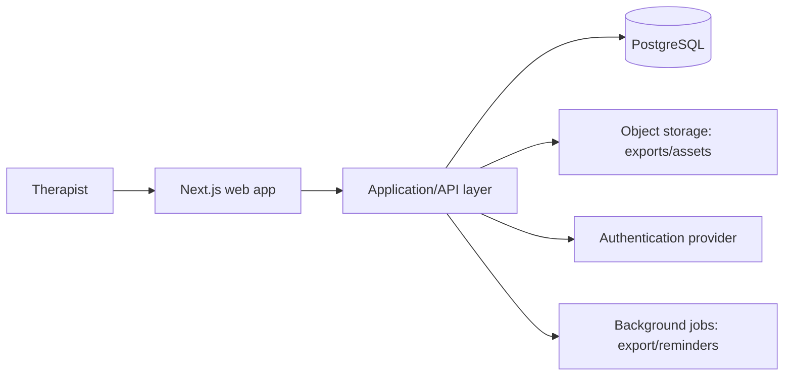

# Technical architecture

## Decision summary

Build the MVP as a responsive web application with a modular monolith architecture. The first scaffold uses Next.js and TypeScript; it keeps sample content local so user experience and the domain model can be validated before connecting accounts or client data.

## System shape

## Bounded modules

| Module | Responsibility | Key data |
| --- | --- | --- |
| Identity & workspace | Therapist, spa, role, tenant boundaries | User, workspace, membership |
| Theme library | Reviewed reusable foundations | Theme, revision, safety guidance |
| Session Builder | A therapist’s working blueprint | Session, configuration, checklist |
| Preferences | Minimal, client-stated personalization | Client profile, preference, exclusion |
| Consent prompts | In-session safety confirmations | Consent checkpoint, timestamp, wording version |
| Reflection | Repeatable quality learning | Session rating, private note |
| Export | Branded printable output | Export request, document reference |

## Data model (initial)

`Workspace` owns `User`, `Theme`, `ClientProfile`, and `SessionBlueprint`. A blueprint references a theme revision but stores a snapshot of the selected configuration so it remains historically accurate. `ConsentCheckpoint` and `Feedback` belong to a blueprint. Client profiles hold only minimal preference fields in the MVP.

## API conventions

Use authenticated, tenant-scoped endpoints or server actions. Validate all input at the boundary, authorize every record by workspace, and return stable domain objects rather than database shapes. Example resources: `/themes`, `/sessions`, `/clients/:id/preferences`, `/sessions/:id/checkpoints`, and `/sessions/:id/export`.

## Delivery phases

1. **Prototype:** curated themes, local builder, preparation screen, print output (this repository).
2. **Private beta:** authentication, encrypted hosted database, save/duplicate/favorite, basic feedback.
3. **Team readiness:** workspace roles, shared approved themes, change history, brand settings.
4. **Production hardening:** privacy review, accessibility audit, threat modeling, backup/restore tests, observability, legal content review.

## Architecture decisions

- Start with a modular monolith to keep early development inexpensive and comprehensible.
- Keep curated content versioned, reviewed, and separate from a user’s custom sessions.
- Do not integrate booking, payments, or clinical records until their domain and compliance requirements have been separately designed.
- Use a relational database when persistence begins because sessions, themes, preferences, permissions, and auditability have strong relationships.

