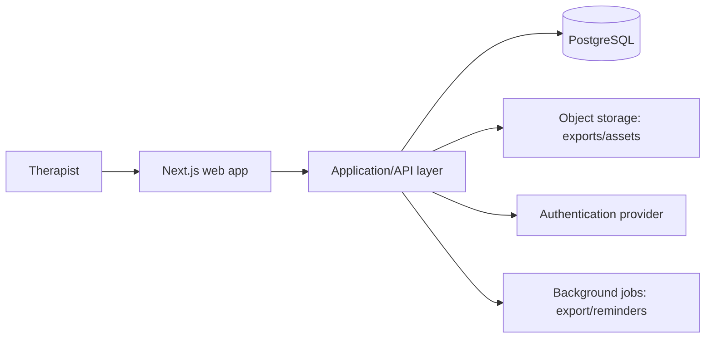

# Technical architecture

## Decision summary

Build the MVP as a responsive web application with a modular monolith architecture. The first scaffold uses Next.js and TypeScript; it keeps sample content local so user experience and the domain model can be validated before connecting accounts or client data.

## System shape

## Bounded modules

| Module | Responsibility | Key data |
| --- | --- | --- |
| Identity & workspace | Therapist, spa, role, tenant boundaries | User, workspace, membership |
| Theme library | Reviewed reusable foundations | Theme, revision, safety guidance |
| Session Builder | A therapist’s working blueprint | Session, configuration, checklist |
| Preferences | Minimal, client-stated personalization | Client profile, preference, exclusion |
| Consent prompts | In-session safety confirmations | Consent checkpoint, timestamp, wording version |
| Reflection | Repeatable quality learning | Session rating, private note |
| Export | Branded printable output | Export request, document reference |
| Editorial | Versioned owner/editor articles and public publishing | Blog post, revision, topic, review state |
| Provider community | Account-gated professional discussions | Category, thread, post, follow, reaction |
| Trust & safety | Reporting, moderation, appeals, and auditability | Report, action, policy version, appeal |

## Data model (initial)

`Workspace` owns `User`, `Theme`, `ClientProfile`, and `SessionBlueprint`. A blueprint references a theme revision but stores a snapshot of the selected configuration so it remains historically accurate. `ConsentCheckpoint` and `Feedback` belong to a blueprint. Client profiles hold only minimal preference fields in the MVP. Editorial content is versioned separately from its published projection. Community content records author, visibility, moderation state, and policy version without sharing free-form fields or search indexes with client preferences.

## API conventions

Use authenticated, tenant-scoped endpoints or server actions. Validate all input at the boundary, authorize every record by workspace, and return stable domain objects rather than database shapes. Example resources: `/themes`, `/sessions`, `/clients/:id/preferences`, `/sessions/:id/checkpoints`, `/sessions/:id/export`, `/articles`, `/community/threads`, `/community/posts`, and `/community/reports`. Public article reads and provider-only community reads use separate authorization and cache rules.

## Delivery phases

1. **Prototype:** curated themes, local builder, preparation screen, print output, and browser-local account-flow validation (this repository).
2. **Private beta:** managed authentication, secure server-side sessions, encrypted hosted database, save/duplicate/favorite, and basic feedback.
3. **Team readiness:** workspace roles, shared approved themes, change history, brand settings.
4. **Production hardening:** privacy review, accessibility audit, threat modeling, backup/restore tests, observability, legal content review.
5. **Community beta:** public versioned articles, registered-provider threads and replies, reporting, moderation, audit history, notification controls, and measured facilitation.

## Architecture decisions

- Start with a modular monolith to keep early development inexpensive and comprehensible.
- Keep curated content versioned, reviewed, and separate from a user’s custom sessions.
- Do not integrate booking, payments, or clinical records until their domain and compliance requirements have been separately designed.
- Use managed PostgreSQL when persistence begins because sessions, themes, preferences, permissions, content revisions, community discussions, and auditability have strong relationships. PostgreSQL row-level security and full-text search support the initial tenancy and content-discovery needs.
- Keep the current static export only for prototype behavior. Production authentication, private content, moderation, and durable writes require a server/API deployment.
- The browser-local preview account stores only a display name, email, and session marker. It deliberately stores no password and provides no security boundary; replace it with managed identity before private beta.
- Follow [Data persistence and security requirements](data-persistence-security.md) for schema controls, backups, retention, authentication, tenancy, content security, audit, and production release gates.
