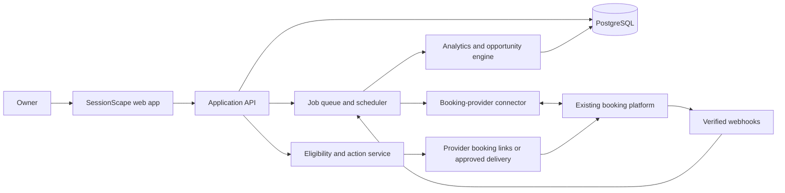

# Technical architecture

Status: Target architecture for the redefined MVP
Last updated: 2026-09-06

## Decision summary

Build SessionScape as a responsive web application and modular monolith with asynchronous provider synchronization. Keep provider adapters, normalized operational data, analytics, recommendations, action eligibility, and outcome attribution as separate modules. This supports a one-provider MVP without coupling the product to that provider.

The current front-end prototype predates this architecture and contains no production connection or data boundary.

## System shape

```mermaid
flowchart LR
  O[Owner] --> W[SessionScape web app]
  W --> A[Application API]
  A --> DB[(PostgreSQL)]
  A --> J[Job queue and scheduler]
  J --> C[Booking-provider connector]
  C <--> P[Existing booking platform]
  P --> H[Verified webhooks]
  H --> J
  J --> E[Analytics and opportunity engine]
  E --> DB
  A --> G[Eligibility and action service]
  G --> L[Provider booking links or approved delivery]
  L --> P
```

## Bounded modules

| Module | Responsibility | Key data |
| --- | --- | --- |
| Identity and workspace | Users, roles, tenancy, entitlements | User, workspace, membership |
| Provider connections | OAuth state, encrypted credentials, scopes, capability manifest | Connection, credential reference, capability |
| Connector | Provider API/webhook behavior and provider-to-normalized mapping | Sync cursor, source reference, webhook receipt |
| Normalized booking data | Minimum operational projection used by SessionScape | Location, practitioner, service, customer reference, appointment, availability |
| Synchronization | Initial import, incremental jobs, retry, reconciliation, freshness | Sync run, checkpoint, error, completeness |
| Analytics | Metric definitions and period calculations | Metric observation, definition version |
| Opportunity engine | Deterministic detection and later model-assisted ranking | Opportunity, rule version, rationale, estimate |
| Eligibility and suppression | Consent basis, exclusions, contact eligibility, suppression | Eligibility decision, suppression, evidence |
| Actions | Owner review, edits, approval, audience snapshot, booking link | Action, audience snapshot, content version, approval |
| Attribution | Link/action correlation with bookings and completion | Touchpoint, attribution rule, outcome |
| Audit and operations | Security and business event history, health, support diagnostics | Audit event, operational alert |

## Connector boundary

The connector returns stable domain objects and a per-merchant capability manifest. Missing provider capabilities remain explicit; the system must not manufacture availability or completion data.

Provider credentials are encrypted and separated from application records. Webhooks require signature verification, replay protection, idempotent processing, and reconciliation because delivery cannot be assumed complete or ordered.

## Data principles

- Store provider identifiers with provider, merchant, and tenant namespace.
- Use an allowlist for source fields; do not ingest free-form notes, intake answers, health data, or payment card data.
- Preserve source timestamps and statuses alongside normalized states for reconciliation.
- Record metric and rule versions so an owner can understand historical results.
- Separate contact eligibility from opportunity ranking.
- Snapshot an approved action's audience and content for audit and attribution.
- Apply retention and deletion to raw provider payloads, normalized records, credentials, and derived analytics separately.
- Exclude customer identifiers from product analytics and telemetry.

## API shape

Representative resources:

- `/workspaces/:id/provider-connections`
- `/provider-connections/:id/sync-runs`
- `/dashboard?period=...`
- `/metrics/:id/explanation`
- `/opportunities`
- `/opportunities/:id/dismiss`
- `/actions/:id/review`
- `/actions/:id/approve`
- `/actions/:id/outcomes`
- `/suppressions`

All private endpoints are authenticated, tenant-scoped, authorized by role, rate-limited where appropriate, and protected against cross-workspace cache or job access.

## Delivery phases

1. **Discovery prototype:** synthetic dashboard, metric definitions, opportunity rules, action review, and provider-link handoff.
2. **Connector spike:** current provider API verification, sandbox fixtures, normalization, capability manifest, and reconciliation.
3. **Private connected beta:** managed identity, tenant isolation, one read-only provider connection, initial sync, dashboard, and explainable opportunities.
4. **Action pilot:** owner-reviewed drafts or exports, booking links, eligibility controls, and conservative outcome attribution.
5. **Production hardening:** accessibility, privacy, security, backup/restore, observability, provider outage handling, and support procedures.
6. **Expansion:** direct delivery or provider write capabilities only after their gates pass; a second connector only after the connector boundary is proven.

## Architecture decisions

- Use deterministic rules for initial metrics and opportunity detection. Models may later help rank or draft, but must not define contact eligibility or silently change metrics.
- Keep booking-provider writes outside the MVP.
- Use PostgreSQL for relational tenancy, normalized operational data, auditability, and analytical queries.
- Use background jobs for imports, webhooks, reconciliation, calculations, and outcome updates.
- Treat freshness, completeness, and provider capability as product-visible state.
- Require managed authentication and server-side authorization before any real provider connection.
- Reassess the existing [data persistence and security requirements](data-persistence-security.md) against provider credentials, synchronized customer references, background jobs, action audiences, and attribution before connected beta.
